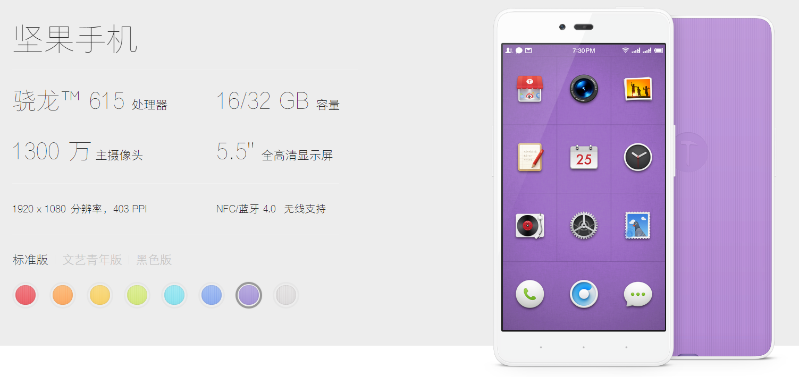

# 尺寸数据

* [坚果手机U1](https://www.smartisan.com/jianguo/)

屏幕：5.5 英寸

高度：152.9 mm

宽度：76.9 mm

厚度：9.0 mm

重量：约 155 g

电池：2900 mAh

----

* [ThinkPad S2 2016](http://detail.zol.com.cn/1143/1142692/param.shtml)

CPU：Intel 酷睿i5 6200U，2.3GHz ~ 2.8GHz，双核心/四线程

内存：DDR4 2133MHz

屏幕：13.3英寸

长度：322.4mm

宽度：222.8mm

厚度：19.1mm

重量：1.47Kg

