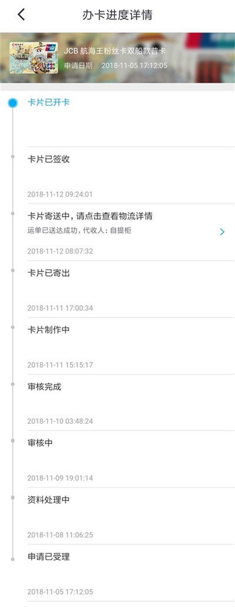

# 申请招行信用卡II

## 下卡经过

1. 11月03日（周六）晚上预约办卡
2. 11月05日（周一）下午业务员联系我，到公司收集资料
3. 11月10日（周六）凌晨「掌上生活」APP状态更新为“**审核完成**”，短信提醒e招卡已核发
4. 11月10日（周六）早上办卡进度更新为“卡片制作中”，同时APP上额度信贷显示为**12000**
5. 11月11日（周日）傍晚办卡进度更新为制卡完成，卡片寄出
6. 11月12日（周一）签收信用卡两张：航海王卡和VISA全币卡
7. 11月12日（周一）激活信用卡

## 说明

1. 航海王卡属于普卡。网上说普卡额度最高1万。现在都8102了，所以最高1万额度不合时宜。
2. 申请航海王卡，「掌上生活」申请进度会看到多了两张卡：VISA全币卡和e招电子卡。
3. e招卡是虚拟卡，审核通过就核发，在「掌上生活」上人脸识别核实身份后，可以绑定使用。

## 官方电话

- 服务热线：95555
- 境外服务热线：8675584391000
- 信用卡服务热线：4008205555

2018年11月12日晚，是为中篇

