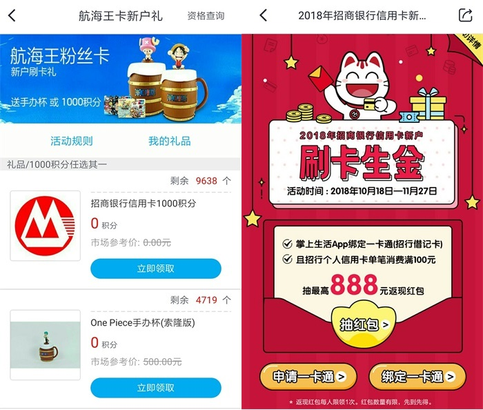
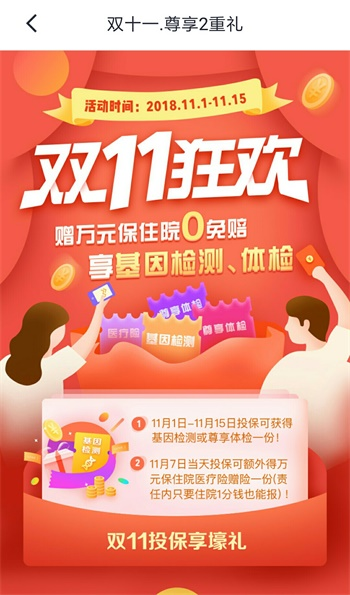

# 申请招行信用卡III

## 第一笔信用卡消费的感受

- 很神奇
- 以前觉得别人刷爆信用卡是不可想象的事情
- 尝试后发现刷信用卡没感觉，不会觉得自己是花了钱

## channels

1. 「招商银行」APP
2. 「掌上生活」APP
3. 「招商银行信用卡」微信公众号
4. 「招商银行信用卡」支付宝生活号
5. 「招行专业版」PC端

## 新户福利特权

入口：「掌上生活」APP -> 我的 -> 活动奖励

一般也就是参与“首刷礼”、刷卡金、还款金等活动：

## 绑定微信公众号的好处？

- 实时消费提醒
- 还款提醒
- 查询账单明细
- 申请提额
- 查额度，查积分
- 其他福利

## 如何攒积分？

1. 每日签到（前三个channel）
2. 参加积分活动
3. 参加积分游戏
4. 刷卡消费

## 「掌上生活」也可以买保险

品种比较少，但是可以考虑。

## 「招行专业版」的一个隐藏用途

- 查询个人征信

我之前在蚂蚁借呗上借过钱，半个月前才还清。不知道为什么这次征信报告没有看到相应记录，可能是还没上报吧。

2018年11月14日 写于凌晨，是为下篇

