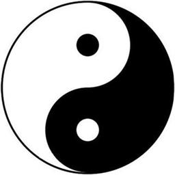

# 太極圖說  

> 周敦頤

無極而太極。太極動而生陽，動極而靜，靜而生陰，靜極複動。一動一靜，互為其根。分陰分陽，兩儀立焉。陽變陰合，而生水火木金土。五氣順布，四時行焉。五行一陰陽也，陰陽一太極也，太極本無極也。

五行之生也，各一其性。無極之真，二五之精，妙合而凝。乾道成男，坤道成女。二氣交感，化生萬物。萬物生生而變化無窮焉。

唯人也得其秀而最靈。形既生矣，神發知矣。五性感動而善惡分，萬事出矣。聖人定之以中正仁義而主靜，立人極焉。

故聖人“與天地合其德，日月合其明，四時合其序，鬼神合其吉凶”，君子修之吉，小人悖之凶。故曰：“立天之道，曰陰與陽。立地之道，曰柔與剛。立人之道，曰仁與義。”又曰：“原始反終，故知死生之說。”大哉易也，斯其至矣！

