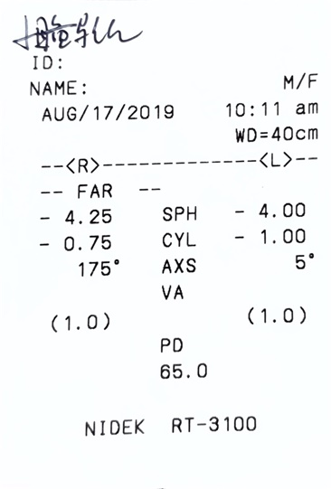
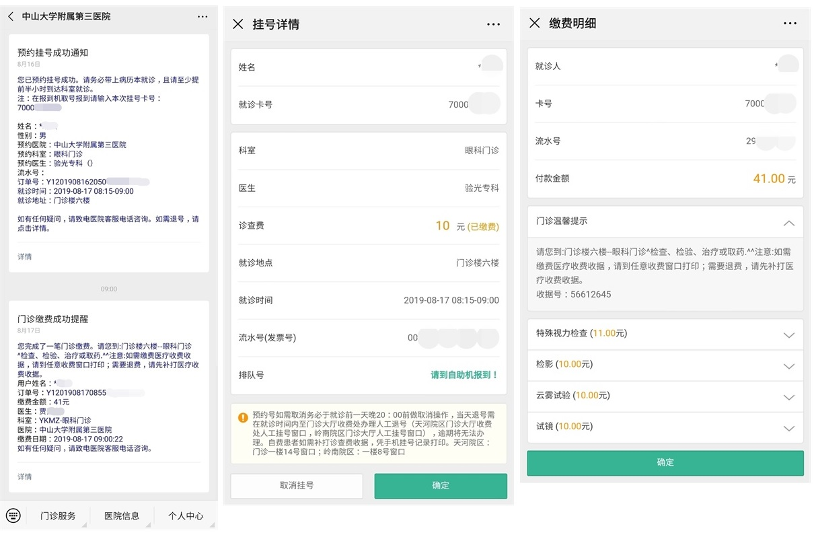

# 验光经历

## 客观条件

性别男，年龄25，地点广州，就诊医院中山三院，就诊时间2019-08-17早上，近视多年有佩戴眼镜，挂号和缴费全程是在中山三院的微信公众号上操作。

## 经历

1. 关注医院微信公众号，实名认证获取就诊卡，**网上挂号**
2. 到达医院，抵达对应科室，在自助**报到机**上刷身份证取号，打印就医凭证
3. 走廊**候诊**，进入科室后凭证交医师，医师打印缴费单
4. 缴费处缴费或微信上**自助缴费**
5. 验光室外凭缴费单或微信缴费记录，**排队**验光
6. 医生叫到名字后进入科室**验光**，先是眼压计，再是验光仪
7. 拿**验光单**走人

## 时间

公交到医院20分钟，取号几秒，候诊加打印清单几秒，缴费几秒，排队1小时，验光5分钟 。

## 注意事项

* **纯验光**一定要挂**验光专科**。像南医三院没有验光专科，所以要挂眼科门诊，10元挂号+236元检查费（包含验光）。
* 网上挂号和缴费虽然**方便**，但是没法走**医保报销**流程，广州只有少数几家医院支持，中山三院是不支持的。

## 近视程度

| **度数**  | **近视程度** |
| --------- | ------------ |
| 0 ~ 300   | 轻度         |
| 300 ~ 600 | 中度         |
| 600 ~ 900 | 高度         |
| 900 以上  | 超高度       |

注：我们说的度数是指**眼睛屈光度**，跟视力表**对数视力**没有关联。

## 验光单

| **字符** | **英文名称** | **中文名称** | **解释说明** | **我的例子**           |
| -------- | ------------ | ------------ | ------------ | ---------------------- |
| WD       |              | 检测模式     |              | 40厘米的近距离检测模式 |
| R        | Right        | 右眼         |              |                        |
| L        | Left         | 左眼         |              |                        |
| SPH      | Sphere       | 球镜值       | 近远视度数   | 左400°，右425°         |
| CYL      | Cylinder     | 柱镜值       | 散光度数     | 左100°，右75°          |
| AXS      | Axis         | 轴位值       | 散光的方向   | 左5°方向，右175°方向   |
| VA       | Vision       | 矫正视力     |              |                        |
| PD       |              | 双眼瞳距     |              | 瞳距65mm               |

## 费用

* 来回公交费共 4 元
* 挂号费 10 元
* 检查费 41 元

注：初次验光需要散瞳验光，散瞳需要 30 分钟，费用**应该**是 20 元，所以检查费**可能**需要 61 元。我没有散瞳和试镜。

## 预约和缴费记录

## 配镜

* 镜框
* 镜片
* 太阳镜夹片
* 3D眼镜夹片
* IMAX眼镜夹片

