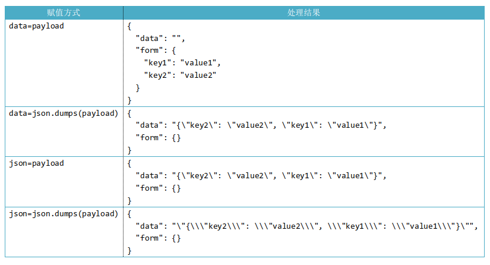

# requests.post方法中的data和json参数

## 写作由来

工作中常用到 `requests` 库，但是对于 `post` 方法的 `data` 和 `json` 参数比较模糊。

下面的笔记主要是弄清楚这些区别。

## 先说说get方法

### 一个get方法例子

```python
import requests

url = 'https://www.baidu.com/s'
params = {'wd': 'abc', 'ie': 'utf-16'}

resp = requests.get(url=url, params=params)
print(resp.url)
# https://www.baidu.com/s?wd=abc&ie=utf-16
```

### 解释

* `params` 是关键字参数，默认为None
* `params` 一般是字典类型，也可以是字节类型
* `params` 用于构成 URL 的查询字符串(query string)，以便传递数据

### 注意

1. 字典里值为 `None` 的键都不会被添加到 URL 的查询字符串里。

## 再谈谈post方法

### 测试代码

```python
import requests

payload = {'key1': 'value1', 'key2': 'value2'}

r = requests.post("http://httpbin.org/post", data=payload)
print(r.text)

r = requests.post("http://httpbin.org/post", json=payload)
print(r.text)
```

### 解释

这个网上解释一大把，我直接上图：



### 总结

1. 表单方式提交：`data=dict`
2. json方式提交：`data=str` 或者 `json=dict`

### 注意

1. 若指定了 `"Content-Type" : "application/x-www-form-urlencoded"`，对于上图的处理结果，`data` 参数为空字符串`""`，字符串通过 `form` 传递。
2. 若 `data` 和 `json` 同时赋值，那只有 `from` 有值 `data` 为空字符串。

## 参考

* [官方入门手册](http://docs.python-requests.org/zh_CN/latest/user/quickstart.html)

