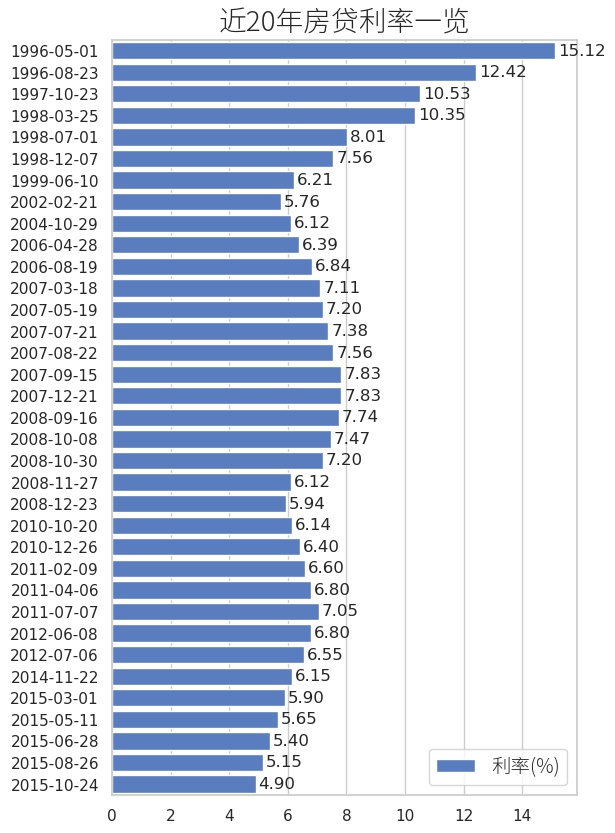

# 数据可视化之柱状图 - 历年房贷利率

## 要点

* 通过pandas读取、处理csv数据
* 使用seaborn绘图
* 数据含有中文，制图输出时含有中文，这都是注意点

## 文件

1. [央行历年贷款基准利率.csv](../files/央行历年贷款基准利率.csv)
2. [代码](../files/seaborn_barplot_demo.py)

## 代码

```python
#! -*- coding: utf-8 -*-

import datetime
import pandas as pd
import seaborn as sns
import matplotlib.pyplot as plt
from matplotlib.font_manager import FontProperties

fname = '/usr/share/fonts/adobe-source-han-sans-cn/SourceHanSansCN-Light.otf'
myfont = FontProperties(fname=fname, size=20)

sns.set(style='whitegrid')
f, ax = plt.subplots(figsize=(6, 12))

# 读取csv数据，因为内容含中文，所以要指定编码
loan_rate = pd.read_csv(u'央行历年贷款基准利率.csv', encoding='gb18030')

# 只需要取时间和五年以上的贷款利率
df = loan_rate.iloc[:, [0, -1]]
df.columns = ['date', 'rate']
df.date = pd.to_datetime(df.date, format='%Y.%m.%d').astype('unicode')
df = df[::-1]

sns.set_color_codes('muted')
sns.barplot(x='rate', y='date', data=df, 
            label='利率(%)', color='b')

ax.legend(ncol=2, loc='best', frameon=True)
ax.set(xlabel='', ylabel='')
plt.title('近20年房贷利率一览', fontproperties=myfont)

# bbox_inches需要设置为tight，否则保存下来的图不完整
f.savefig('近20年房贷利率柱状图.jpg', dpi=100, bbox_inches='tight')
plt.show()
```

## 效果图



## 待完善

1. 图例的中文没有显示出来
2. 想要在柱顶显示对应数值

