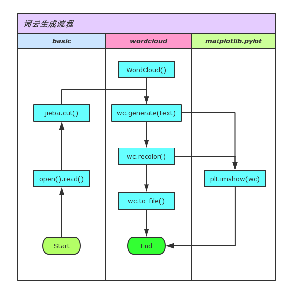
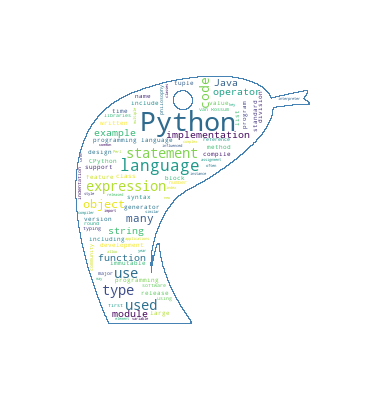
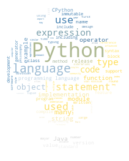
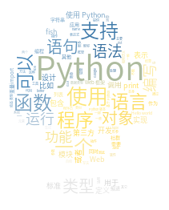

# 有趣的 python 词云

## 安装思源黑体

制造中文词云的时候，如果字体不支持中文，将“如愿”得到一堆方框图，如此：


安装思源黑体命令如下：

```
$ sudo yum install adobe-source-han-sans-cn-fonts

# 这个就是中文思源黑体的字体目录
$ ls /usr/share/fonts/adobe-source-han-sans-cn/
```

## 安装词云库

```
# 如果通过pip安装
$ pip install wordcloud

# 如果通过conda安装
$ conda install -c conda-forge wordcloud
```

## 词云生成流程

读取文本 -> 分词滤词 -> 构造词云实例 -> 载入词汇 -> 调整图片属性 -> 展示词云 -> 保存词云图

大致过程如图：



## WordCloud类

```python
class WordCloud(object):
    def __init__(self,
        font_path=None,            # 字体路径，默认DroidSansMono.ttf，所以中文要重新指定字体库
        width=400,
        height=200,
        margin=2,
        ranks_only=None,
        prefer_horizontal=.9,      # 水平词汇:垂直词汇=9:1
        mask=None,
        scale=1,
        color_func=None,           # 图片着色的处理函数
        max_words=200,
        min_font_size=4,
        stopwords=None,            # 屏蔽词，不指定会使用默认的STOPWORDS
        random_state=None,
        background_color='black',  # 图片背景色，默认黑，常用参数
        max_font_size=None,
        font_step=1,
        mode='RGB',
        relative_scaling='auto',
        regexp=None,
        collocations=True,
        colormap=None,
        normalize_plurals=True,
        contour_width=0,           # 图像轮廓宽度，指定mask该参数才有效
        contour_color='black',     # 图像轮廓颜色
        repeat=False
        ):
    
    pass
```

## 例子一

文件：[masked_wordcloud.py](files/masked_wordcloud.py)

效果



```python
#! -*- coding: utf-8 -*-

import numpy as np
from PIL import Image
import matplotlib.pyplot as plt
from wordcloud import WordCloud as WC

text = open('files/python_en.txt').read()
alice_mask = np.array(Image.open('images/logo.png'))

wc = WC(background_color='white', mask=alice_mask, 
        contour_width=1, contour_color='steelblue')
wc.generate(text)

plt.imshow(wc, interpolation='bilinear')
plt.axis("off")
plt.show()

wc.to_file('images/masked_wordcloud.png')

```

## 例子二

文件：[image_colored_wordcloud.py](files/image_colored_wordcloud.py)

效果



```python
#! -*- coding: utf-8 -*-

from scipy.misc import imread
from wordcloud import ImageColorGenerator, WordCloud as WC

text = open('files/python_en.txt').read()
back_coloring = imread('images/python_logo.png')

wc = WC(background_color='white', mask=back_coloring, 
        random_state=42, margin=2)
wc.generate(text)

image_colors = ImageColorGenerator(back_coloring)
wc.recolor(color_func=image_colors)

plt.imshow(wc, interpolation='bilinear')
plt.axis('off')
plt.show()

wc.to_file('images/image_colored_wordcloud.png')

```

## 例子三

文件：[wordcloud_cn.py](files/wordcloud_cn.py)

效果



```python
#! -*- coding: utf-8 -*-

import jieba
from scipy.misc import imread
from wordcloud import ImageColorGenerator, WordCloud as WC

text = open('files/python_zh.txt').read()
cn_text = ' '.join(jieba.cut(text))

font_path = '/usr/share/fonts/adobe-source-han-sans-cn/SourceHanSansCN-Normal.otf'
back_coloring = imread('images/python_logo.png')

wc = WC(font_path=font_path, background_color='white', 
        mask=back_coloring, random_state=42, margin=2)
wc.generate(cn_text)

image_colors = ImageColorGenerator(back_coloring)
wc.recolor(color_func=image_colors)

plt.imshow(wc, interpolation='bilinear')
plt.axis('off')
plt.show()

wc.to_file('images/wordcloud_cn.png')

```

## 更多

1. [官方范例](http://amueller.github.io/word_cloud/auto_examples/index.html)非常详细，可以实践一遍

