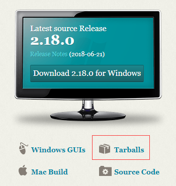

# 搭建 Git 服务器

[Git](https://git-scm.com/) 是一款免费、开源的分布式版本控制系统，用于敏捷高效地处理任何或小或大的项目。

实验时间：2018年06月26日

实验环境：CentOS Linux release 7.5.1804 (Core)

## 安装git

### 软件源安装
```
# yum install git
# git --version
git version 1.8.3.1
```

软件源上的git版本一般比较低，所以下面介绍源码编译安装的方式。

### 源码编译安装

1) 安装依赖库和编译工具

安装相关依赖库

```
# yum install curl-devel expat-devel gettext-devel openssl-devel zlib-devel
```

安装编译工具

```
# yum install gcc perl-ExtUtils-MakeMaker
```

2) 下载git源码包



访问[git官网](https://git-scm.com/)下载tar包，例如：

```
# wget https://mirrors.edge.kernel.org/pub/software/scm/git/git-2.18.0.tar.xz
```

3) 解压和编译

```
# tar zvxf git-2.18.0.tar.gz -C /opt
# cd /opt/git-2.18.0
# make all
# make install prefix=/usr/local
```

编译、安装说明:
* make会编译二进制文件到当前目录下，也就是源码的目录
* prefix默认值就是/usr/local，如果指定其他路径就需要设置环境
* 可以设置环境变量或者做软链接

假设prefix为/usr/local/git:
* 配置环境变量 `# export PATH=/usr/local/git/bin:$PATH`
* 或者链接文件 `# ln -s /usr/local/git/bin/git /usr/bin/git`

4) 验证安装成功

```
# git --version
git version 2.18.0
```
> **[success] 安装成功**
> 
> 安装后就可以使用git命令克隆项目，例如：
> 
> $ git clone https://gitee.com/mirrors/git.git

## 创建git账号

```
# useradd -m git
# passwd git
```

### 禁用shell登录

为了安全，可以禁止git用户远程或本地登陆

编辑`/etc/passwd`将git用户的shell类型从bash改成git-shell

类似这样：```git:x:1001:1001::/home/git:/usr/local/git/bin/git-shell```


或者创建git用户的时候就指定shell类型

```
# which git-shell
# useradd -m git -s /usr/local/git/bin/git-shell
```

## 初始化git仓库

创建裸仓库

```
# mkdir -p /trunk
# cd /trunk
# git init --bare test.git
```

修改属主和权限

```
# chown -R git:git /trunk
# chmod 755 /trunk
```

以后创建的仓库一样需要修改属主和权限

## 克隆远程仓库

```
# git clone git@ip_address:/trunk/test.git
```

### 使用证书登录

需要将登录用户的公钥导入到 /home/git/.ssh/authorized_keys 文件中

```
# mkdir -p /home/git/.ssh
# touch /home/git/.ssh/authorized_keys
# chown -R git:git /home/git/.ssh
# chmod -R 700 /home/git/.ssh
# chmod 600 /home/git/.ssh/authorized_keys
```

> **[info] 注意权限**

| Directory or File    | Permissions |
|----------------------|-------------|
| ~/.ssh               | 700         |
| ~/.ssh/*             | 600         |
| ~/.ssh/config        | 700         |

通过ssh克隆项目

```
# git clone ssh://git@127.0.0.1:22/trunk/test.git
```

## 参考

https://cloud.tencent.com/developer/labs/lab/10045

