# VirtualBox 安装 CentOS7-1611

## 安装CentOS7虚拟机

* 新建虚拟机

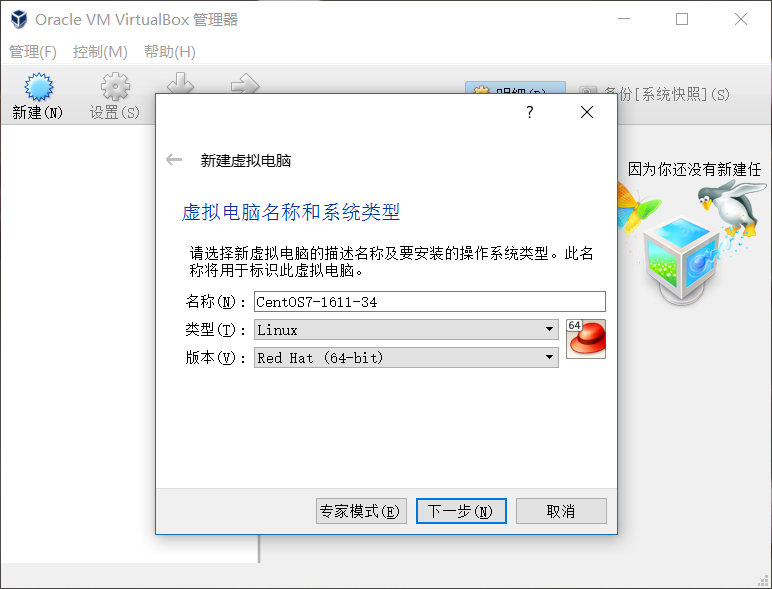

* 配置内存

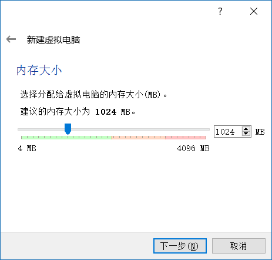

* 配置磁盘1

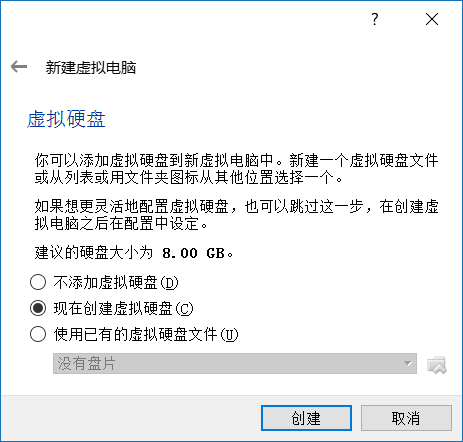

* 配置磁盘2

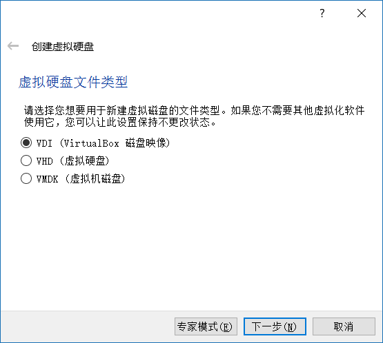

* 配置磁盘3

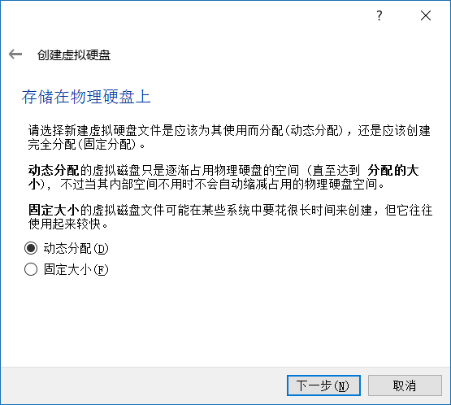

* 配置磁盘4

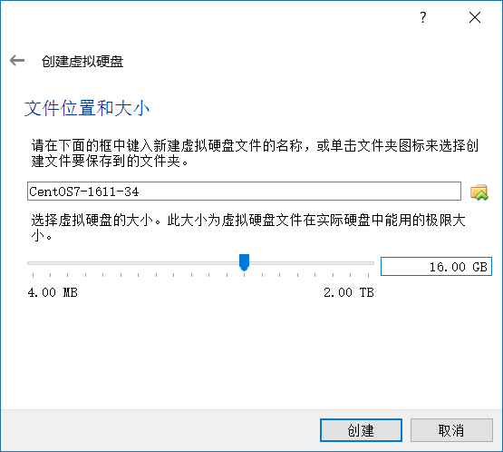

* 创建完成虚拟机

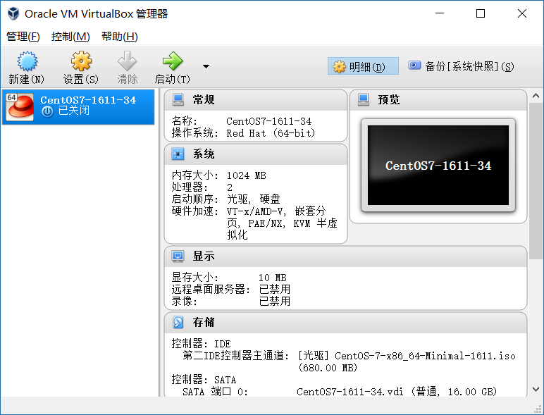

* ISO引导安装

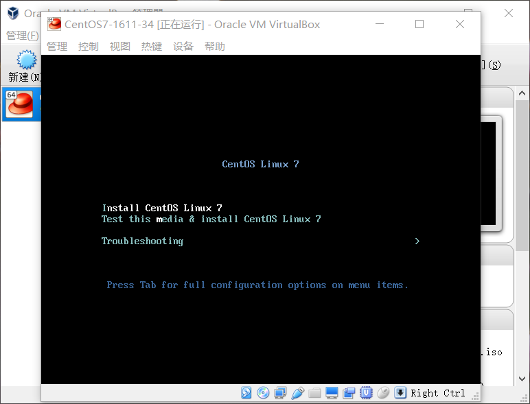

* 设置语言

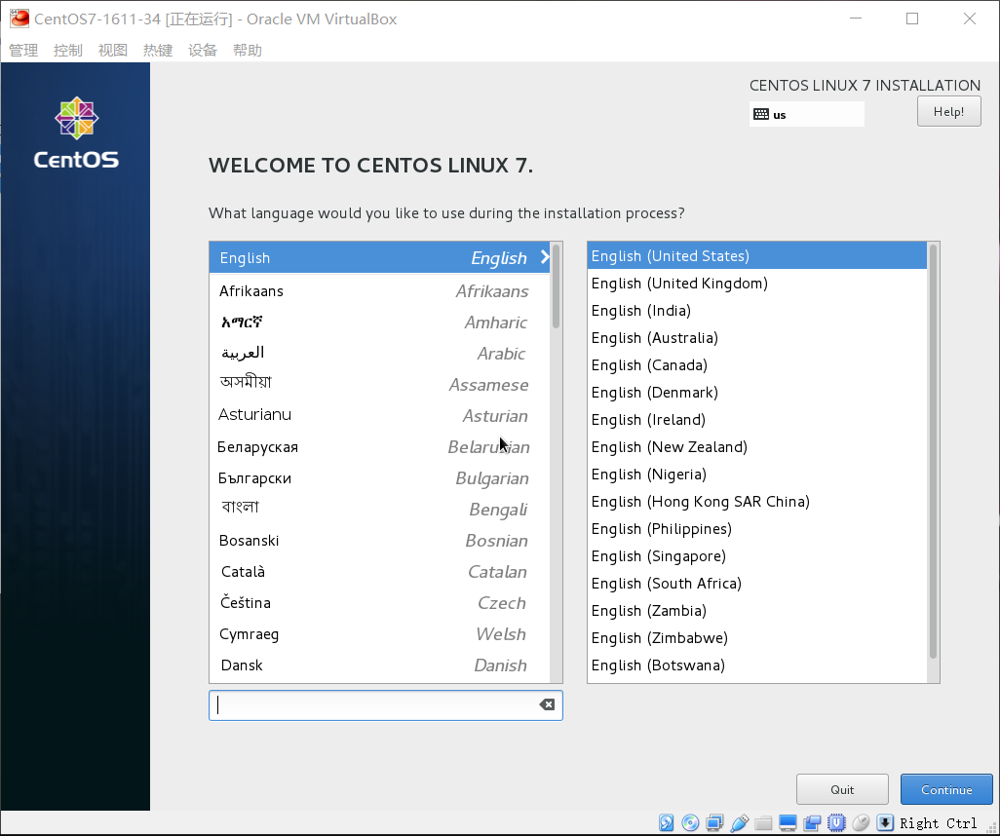

* 设置其他

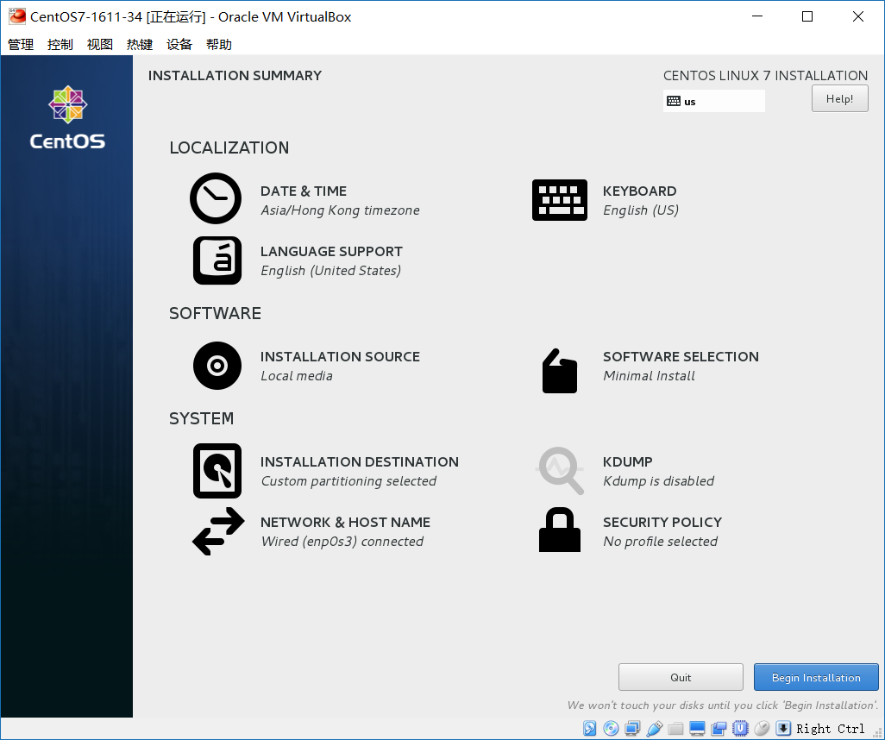

* 完成安装

* 重启进入新系统

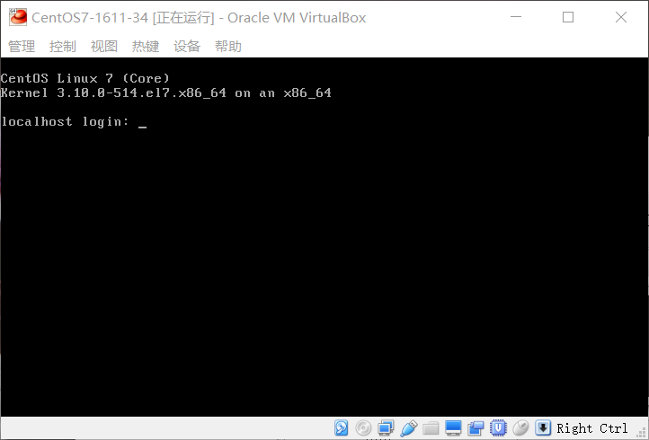

> **[success] 温馨提示**
> 
> 创建虚拟机并安装好系统后，可以打一个虚拟机快照(snapshot)，并命名为clean system

----

## 无法创建64位虚拟机问题

只能新建32位的虚拟机系统，很可能是因为主板禁用了虚拟化的功能，开启后即可解决。

- 只能创建32位虚拟机系统

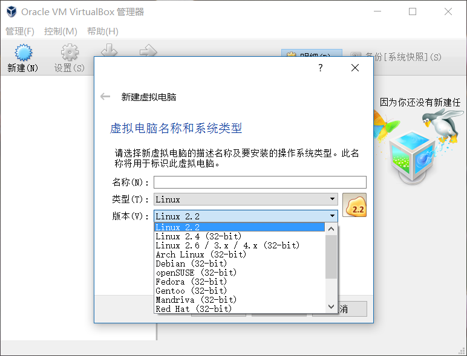

- 重启进入BIOS，找到虚拟化选项

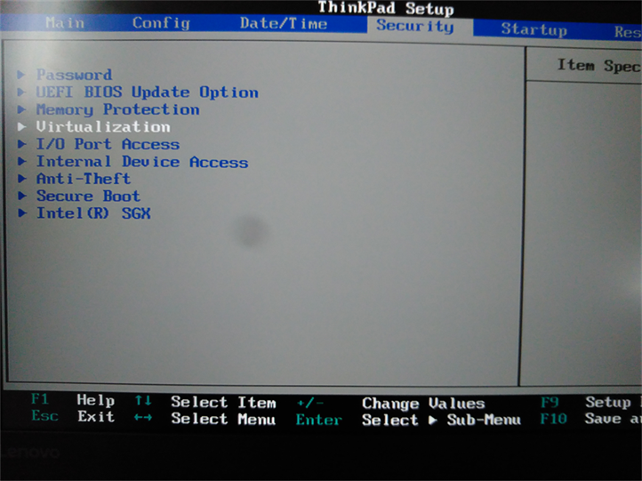

- 修改为enable开启虚拟化功能

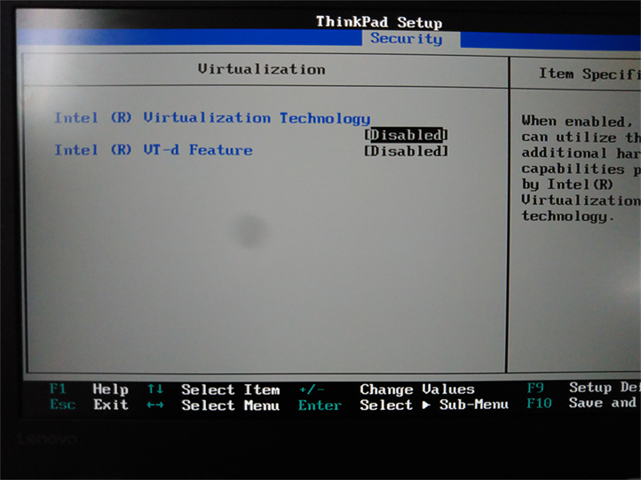

- 已经可以创建32/64位虚拟机

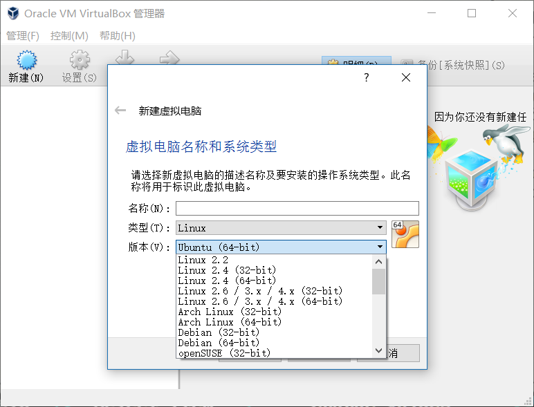

